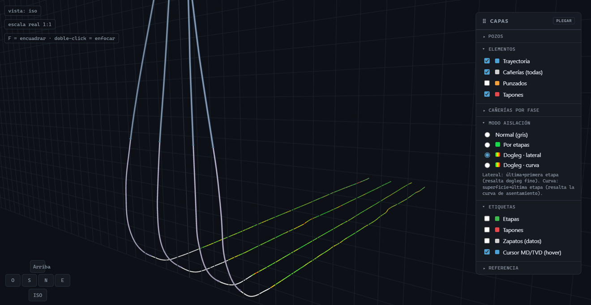

<div align="center">


### Visor 3D de pozos y pads para terminación no convencional

*Navegá el subsuelo de tu pad a escala real, prendé y apagá lo que querés ver, y exportá esquemas listos para informes y correos.*

[]()
[]()
[]()
[]()
[]()

</div>

---

## Qué es

**Vaca Viewer** es una app web para visualizar la geometría de subsuelo de pozos horizontales de fractura (plug-and-perf). Corre **en el navegador**, funciona **offline** y los datos operativos **nunca se suben a ningún servidor**: todo se procesa en tu máquina.

Está pensada para el flujo real de campo —survey de geonavegación, tally de entubado y fracplan de punzados/tapones— los formatos que ya exportás de OpenWells y Excel.



---

## Las cuatro secciones

| | | |
|:-:|:--|:--|
| 🧭 | **Vista 3D** | El pad completo a escala real 1:1. Orbitás, hacés zoom y desplazás como en un CAD; prendés/apagás capas por pozo y por elemento (trayectoria, cañerías, punzados, tapones, etapas, dogleg). Medís distancias entre puntos. |
| 🖼️ | **Exportar** | Imágenes de fondo blanco para documentos. **Vista 3D** (isométrica o la vista actual) y **corte de pozo 2D** (esquema oil&gas de manual: cañerías, cemento, zapatos, tapones, packers, punzados por etapa). Todo a **PNG / JPG / PDF**, en color o blanco y negro. |
| ✏️ | **Datos** | Importás survey (`.xlsx`), tally (`.pdf`) y fracplan (`.xlsx`), o cargás/editás a mano. Cada pozo lleva su nombre editable y se colapsa para trabajar cómodo; el tally de aislación lista los caños cortos detectados. La tabla del pad se exporta a `.xlsx` o imagen, y el pad se guarda sobre el mismo `pad.vvwp` abierto (Guardar / Guardar como / Exportar copia). |
| ⚙️ | **Configuración** | Exageración vertical, diámetros, radios de punzado, formato de etiquetas y demás preferencias de vista. |

---

## Novedades (v0.4)

**Vista 3D:**

- **Planos envolventes** (piso + pared de fondo + pared lateral) con numeración de grilla: N/S, E/O y profundidad. La pared lateral se reubica sola para quedar siempre por detrás de los pozos, y los números de fondo se ocultan cuando un pozo pasa por delante. El tamaño de los números tiene su propio slider.
- **Regla de ramas horizontales**: el cero se elige entre la **boca** del pozo o el **inicio de rama** (primera etapa / landing), para leer la extensión lateral directamente sobre la grilla.
- **Colores de etapas**: el modo "por etapas" alterna un **par de colores configurable** (verdes suaves, turquesa/azul, naranja/azul, magenta/cian…).
- **Cuadros flotantes**: los paneles de la Vista 3D (Pozos, Modo aislación, Etiquetas, Referencias) se colapsan, se arrastran y **recuerdan su posición**. El panel de pozos es una **matriz pozo × elemento** con toggles por fila y por columna. Botón *Reordenar cuadros* por si alguno quedó fuera de pantalla al cambiar de monitor.

**Exportar → corte de pozo 2D:**

- **Tema "Color (dogleg)"**: el interior del pozo se pinta con la rampa verde→amarillo→rojo según el DLS del survey (auto-normalizada al rango visible, con leyenda de escala); las etapas muestran solo el N° con halo blanco. Los punzados se ven igual en los tres temas (color / dogleg / B&N).
- **Regla de extensión (MD)**: opcional, debajo del esquema y pegada al pozo; va del tope de la etapa más somera hasta TD, con los ticks alineados con tapones y demás elementos del lateral.
- **Carteles de caños cortos / xover**: descripción completa (acero, libraje, tipo) + `5,87m - @2490m MD`.
- **Shoetrack como una sola cosa**: una única caja "Shoetrack" lista sus componentes línea por línea y se arrastra entera.
- **Margen blanco**: slider que agrega borde alrededor de la imagen — aire para reordenar cajas y seguir editando después de exportar.
- En el lateral solo los tapones van rotados; todos los demás carteles son horizontales, y el lienzo crece siempre para no recortar etiquetas.

**Sección Datos, renovada:**

- **Pozos con nombre**: cada pozo del constructor se titula `1. Nombre del pozo` — el nombre se edita clickeándolo. Los pozos se **colapsan** uno a uno (click en la cabecera) o todos juntos con el botón *Colapsar pozos*.
- **Caños cortos a la vista**: al cargar el tally de aislación aparece un listado debajo de sus detalles con tipo (casing corto / xover), MD desde, longitud y detalle de cañería/acero.
- **Tabla del pad exportable**: la tarjeta *Pad cargado* se colapsa, y la tabla se descarga como **planilla `.xlsx`** o como **imagen PNG de fondo blanco** lista para pegar en informes.
- **Guardar de verdad**: tres acciones — **Guardar** (escribe sobre el mismo `.vvwp` que abriste; si el pad es nuevo, se comporta como *Guardar como*), **Guardar como…** (elegís destino) y **Exportar copia** (descarga clásica). Usa la File System Access API (Chrome/Edge); en navegadores sin soporte cae a descarga.
- **Espacio optimizado**: la sección usa todo el ancho de la ventana y se quitaron los textos introductorios.

**Fix de ingesta**: el parser del run tally descartaba mal las columnas numéricas extra del PDF (peso acumulado) y las metía en la descripción de los caños cortos (p. ej. `142.5752 5, 18, P-110…`). Ahora la descripción sale limpia (`5, 18, P-110 ICY W-463 CASING MARCA`), tanto en el parser del navegador como en `build_pad.py`. Los pads guardados antes del fix conservan el texto viejo: basta recargar el tally de aislación.

---

## Cómo se usa

**1. Abrí la app.** Serví la carpeta por HTTP y entrá con el navegador:

```bash
python3 -m http.server 8080     # abrí http://localhost:8080
```

> Para un único archivo portable y offline: `python3 build.py` genera `dist/index.html` con todo embebido.

**2. Cargá un pad.** En la sección **Datos**, arrastrá un `pad.vvwp` existente, o construilo cargando los archivos crudos por pozo (el survey y el fracplan son opcionales; sin survey se asume pozo vertical).

**3. Explorá en 3D.** Con el pad cargado saltás a **Vista 3D**. Usá el panel de **Capas** (arriba a la derecha) para mostrar solo lo que te interesa, la veleta de la esquina para las vistas cardinales, y `F` para encuadrar.

**4. Exportá.** En **Exportar** elegís entre la vista 3D o el corte 2D de un pozo, ajustás con los sliders y descargás la imagen.

### Atajos

| Acción | Control |
|:--|:--|
| Cambiar de sección | `1` `2` `3` `4` |
| Orbitar · desplazar · zoom | arrastrar · click derecho · rueda |
| Encuadrar todo | `F` |
| Medir | `M` |

---

## Estructura del repo

```
vaca-viewer/
├── index.html       → shell HTML (markup + libs)
├── src/             → módulos ES: viewer, export3d, export2d, export-ui, util, main + styles.css
├── build.py         → empaqueta todo en dist/index.html (single-file offline)
├── build_pad.py     → parsers de survey/tally/fracplan en Python
├── docs/data-schema.md  → especificación del formato JSON del pad
└── samples/         → pads de ejemplo
```

El formato de intercambio es un **JSON propio y versionado** (`schema_version`); profundidades en metros, diámetros en pulgadas, coordenadas locales al pad. Especificación completa en [`docs/data-schema.md`](docs/data-schema.md).

> 🔒 Los datos reales de pozos van en `data/` (ignorada por git). El repositorio solo contiene código y ejemplos anonimizados.

---

## Autor y licencia

**Gonzalo Carvallo** — 📧 [gonzacarv@gmail.com](mailto:gonzacarv@gmail.com) · 🐙 [@gonzacarv](https://github.com/gonzacarv)

© 2026 Gonzalo Carvallo. Todos los derechos reservados. Uso, reproducción o modificación solo con autorización expresa del autor; ver [`LICENSE`](LICENSE).

<div align="center">

*Hecho con 🧉 en Neuquén · Vaca Muerta*

</div>
